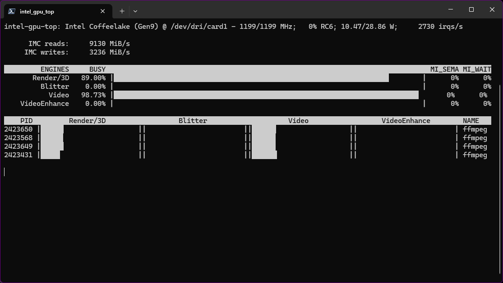
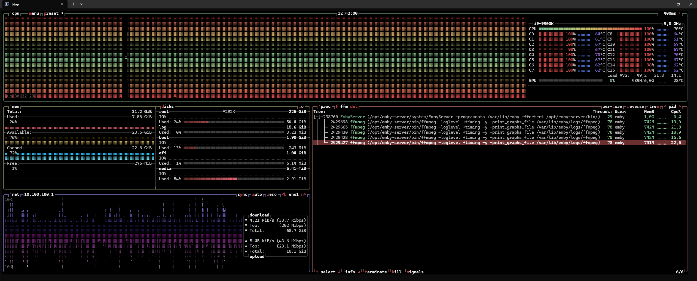

# Emby Quirks We Learned the Hard Way

A collection of undocumented Emby server behaviors discovered through
hours of reading raw ffmpeg commands from server logs, reverse-engineering
Emby's web client, and a lot of trial and error. These findings apply to
Emby Server 4.10.x and may or may not apply to other versions.

If you're building a third-party client for Emby's HLS streaming API,
this document might save you a few weekends.

---

## 1. `VideoCodec=h264` does NOT force a transcode

You'd think telling Emby "I want h264 output" would make it re-encode
the video. It doesn't. If the source is already h264, Emby interprets
this as "the client accepts h264" and **stream-copies** the video
unchanged. The ffmpeg command will show `-c:v:0 copy` instead of
`-c:v:0 h264` or `-c:v:0 h264_nvenc`.

This is "working as designed" from Emby's perspective -- why waste CPU
re-encoding something that's already in the right format? The problem
is that stream-copy preserves the source's original keyframe layout,
and VBR files with wide keyframe intervals (the x264 default of
`keyint=250` = ~10 seconds between keyframes) produce HLS segments
that lie about their duration. The playlist says 6.0000 seconds per
segment, the actual content doesn't match, and HLS.js loses its mind
when you try to seek.

**The fix:** `EnableAutoStreamCopy=false` on the HLS request URL.

---

## 2. `EnableDirectPlay=false` and `EnableDirectStream=false` are advisory only

These parameters go on the `PlaybackInfo` POST request. Emby's own
web client sends them on its fallback path (after Direct Play fails
in the browser). You'd think they'd force a transcode.

They don't. They only affect what Emby **recommends** in the
PlaybackInfo response -- which playback method the client *should*
use. The DynamicHlsService endpoint that actually serves the HLS
stream makes its own independent decision based on the codec/bitrate
parameters in the URL.

Worse: if you put `EnableDirectStream=false` on the HLS URL itself
(not on PlaybackInfo), Emby returns a 404 for every segment. It
disables the stream-copy path but doesn't enable a replacement
transcode path, leaving the session in limbo.

**The fix:** Don't use these. Use `EnableAutoStreamCopy=false` on the
HLS URL instead.

---

## 3. `EnableAutoStreamCopy=false` is the actual flag you want

This goes on the `master.m3u8` URL as a query parameter. It's
documented in Emby's API docs as "Whether or not to allow automatic
stream copy if requested values match the original source. Defaults
to true."

When set to `false`, Emby will **always re-encode** the video through
ffmpeg, even when the source codec, bitrate, and resolution all match
the requested output. This produces uniform HLS segments with
controlled keyframe intervals, which is what you need for reliable
seeking with HLS.js.

On servers with hardware encoders (NVENC, QSV, VAAPI), the re-encode
is nearly free. On CPU-only servers, there's a real cost, but it's the
only way to make seeking reliable.

---

## 4. Emby's `PlaybackInfo` doesn't expose peak bitrate

The `BitRate` field in the MediaStreams array of a PlaybackInfo response
is the **average** (or container-level overall) bitrate. There is no
`MaxBitRate`, `PeakBitrate`, or any other field for the peak.

We verified this by querying three different Emby API endpoints
(`POST /Items/{id}/PlaybackInfo`, the same with `Fields=MediaStreams`,
and `GET /Users/{uid}/Items/{id}`) on files where `mediainfo` clearly
shows peak bitrates 2-3x higher than the average. Every response
returned only the average. The peak information exists in the file's
encoder metadata (like x264's `vbv_maxrate`), but Emby's metadata
extractor doesn't read it.

This means you cannot implement a "check peak against cap" strategy.
If the average bitrate is under your quality preset cap, Emby will
stream-copy regardless of how high the peaks go -- unless you use
`EnableAutoStreamCopy=false`.

---

## 5. `AutoOpenLiveStream=true` pre-starts ffmpeg

Emby's own web client sends `AutoOpenLiveStream=true` on the
`PlaybackInfo` POST request. This makes Emby start the ffmpeg
transcoding process in the background immediately, before the client
even requests the first HLS segment.

Without this, ffmpeg only starts when the first `.ts` segment is
requested, adding 300-800ms of latency to the initial playback start
(ffmpeg startup + first segment generation).

With it, the transcode is already running by the time your HLS player
requests `hls1/main/0.ts`, and the first segment may already be ready.
Not game-changing, but noticeable on slower hardware.

---

## 6. Emby's web client restarts the entire pipeline on seek

When you seek in Emby's built-in web player, it doesn't just request
a different segment number from the existing HLS playlist. It:

1. Sends `DELETE /Videos/ActiveEncodings` to kill the old ffmpeg
2. Sends a new `PlaybackInfo` POST with `StartTimeTicks=<seek_position>`
3. Tries Direct Play (`original.mkv`) -- usually fails in the browser
4. Sends another `PlaybackInfo` with `EnableDirectPlay=false&EnableDirectStream=false`
5. Requests a new `master.m3u8` with `StartTimeTicks`
6. Emby starts a fresh ffmpeg with `-ss <seek_time>`

This is why seeking works perfectly in Emby's web player even with
stream-copy on VBR files: it doesn't reuse segments from the old
transcode. It nukes everything and starts fresh from the seek position.
The ffmpeg `-ss` flag seeks to the nearest keyframe in the source,
and from that keyframe forward, the stream-copy produces segments
that match the new playlist.

HLS.js doesn't do this. It treats the playlist as a static VOD
manifest and just picks a different segment number when the user
seeks. No pipeline restart, no new ffmpeg, no `-ss`. That's why
stream-copy + HLS.js + VBR = broken seeking.

You CAN'T replicate Emby's seek behavior with HLS.js because HLS.js
is designed for the standard "server generates a playlist, client
navigates it" model. Emby's web client breaks that model by treating
the playlist as ephemeral. The only option for HLS.js is to ensure
the segments are actually uniform in the first place, which brings
us back to... `EnableAutoStreamCopy=false`.

---

## 7. The segment duration in the playlist is a lie

When Emby stream-copies h264 into HLS segments, the `#EXTINF`
duration in the playlist says something like `6.0000` for every
segment. The actual content of each segment depends on where the
source's keyframes fell. A source with `keyint=250` at 24fps has
keyframes every ~10.4 seconds, so Emby's `-break_non_keyframes 1`
flag cuts segments between keyframes -- but a segment that starts
mid-GOP requires the decoder to have the previous keyframe's data
to render the first frames.

HLS.js trusts the playlist timing. It calculates "segment 37 starts
at 37 * 6 = 222 seconds" and requests that segment when the user
seeks to 222s. But segment 37's actual content might start at 218s
or 226s depending on where the nearest keyframe boundary fell. The
result: wrong scene, playback restart, duration jumping, or 404.

With real transcoding (`EnableAutoStreamCopy=false`), Emby controls
the keyframe interval via `-g` and `-keyint_min`. Every segment
starts at exactly the right position because the encoder put a
keyframe there on purpose.

---

## 8. The "triple failsafe" that isn't

Emby's web client sends `MaxStreamingBitrate`, `h264-profile`,
`h264-level`, and `TranscodeReasons` on its requests. These look
like they'd form a robust decision pipeline for when to transcode.

They don't prevent stream-copy. Even with `TranscodeReasons=AudioCodecNotSupported`,
Emby will happily stream-copy the VIDEO and only transcode the audio.
The "transcode reason" applies to the session as a whole, not to each
individual stream. The video stream gets its own independent
copy-or-encode decision based on codec matching, and that decision
defaults to "copy if codecs match" unless you explicitly disable it
with `EnableAutoStreamCopy=false`.

---

## 9. Concurrent seeks on a shared PlaySessionId cause ffmpeg races

If two users share a PlaySessionId (which happens in a watch party
with a shared transcode) and both seek at roughly the same time,
Emby can spawn two ffmpeg instances writing to the **same** temp
directory and segment list. The two processes race each other,
producing corrupted or conflicting segments.

HLS.js gets a segment written by ffmpeg-A, then the playlist gets
overwritten by ffmpeg-B, so it jumps back to re-fetch, gets the
other version, jumps again. The loop self-corrects after Emby kills
the duplicate ffmpeg (a few seconds), but it's visibly glitchy.

Per-user PlaySessionIds (each user gets their own transcode) avoid
this entirely because each ffmpeg writes to its own temp directory.

---

## 10. The CPU cost of `EnableAutoStreamCopy=false` is real (but mostly solved by QSV)

Forcing a real re-encode is the only way to make HLS.js seek reliably,
and it comes with a CPU cost that's significant -- but only if you're
running on pure software encoding. Real measurements on an i9-9900K
(8c/16t):

| Mode | Polar 2019 (1.95 Mbps h264) | Bubble 2022 (5 Mbps h264) |
|---|---|---|
| Stream-copy (Emby's web player) | ~3% CPU | ~10% CPU |
| Software x264 re-encode (forced) | ~50% CPU @ 10x realtime | ~50% CPU @ ~5x realtime |
| **Intel iGPU QuickSync (UHD 630)** | **~3% CPU** | **~3% CPU** |
| NVIDIA NVENC (dGPU) | ~3% CPU | ~3% CPU |

That's a **10-16x CPU multiplier** for software encoding compared to
stream-copy. The ratio is even worse if the source was encoded with
heavy x264 settings (high `subme`, `b_adapt`, multiple reference
frames, complex partition analysis) -- the decoder has to undo all
of that work frame-by-frame, and you can't tune it down because
those settings are baked into the bitstream.

### Most users already have a hardware encoder

The "buy a GPU" recommendation that early versions of this document
made is mostly unnecessary. **Almost every Intel desktop CPU from the
last decade has Quick Sync (QSV)** built into its iGPU, even if you've
never used it for graphics. The UHD 630 in an i9-9900K, for example,
isn't impressive for gaming -- but its dedicated media engine can
transcode 4-6 simultaneous 1080p h264 streams while leaving the CPU
cores essentially idle (~3% utilization). It's a separate silicon
block from the CPU and from the iGPU's graphics shaders.

The same applies to:

- **Intel desktop / laptop CPUs**: UHD/Iris graphics → QSV
- **AMD APUs and modern Ryzen with iGPU**: VAAPI (similar to QSV
  but on Linux, requires a bit more setup)
- **NVIDIA discrete GPUs**: NVENC (basically every GeForce/Quadro
  from the GTX 600 series onward, with concurrent stream limits
  patched out by the consumer NVENC patch on older cards)
- **Apple Silicon**: VideoToolbox (works out of the box)

If your Emby server is running on essentially any hardware made in
the last 5-10 years that isn't a headless server CPU (Xeon without
iGPU, dedicated CPU-only boards), you probably have hardware
encoding available. You just need to enable it in Emby's
transcoding settings (Settings → Transcoding → Hardware
acceleration).

### Practical capacity per encode mode

We stress-tested this on a **worst-case source** -- Your Name (2016) in a
70+ Mbit/s 4K remux with heavy x264 encoder settings baked into the
bitstream (`subme=10`, `me_range=24`, `b_adapt=2`, large reference
frame counts). Every concurrent user gets their own independent
transcode (2.0's per-user architecture), so these numbers are
per-stream multiplied by user count.

On an i9-9900K (8c/16t, UHD 630 iGPU):

- **Stream-copy** (Emby web player only): 30+ concurrent users,
  basically free -- but doesn't work with HLS.js, which is why we
  can't use it
- **Intel QuickSync (UHD 630 iGPU)**:
  - 2 streams: Video engine at ~97%, Render/3D at ~71%, clean playback
  - 3 streams: Video engine at ~99%, Render/3D at ~90%, still clean
  - 4 streams: Video engine saturated at ~99%, Render/3D at ~89%,
    time-sliced across streams but no visible stalls
  - All at ~10W power draw. For normal party content (5-15 Mbps 1080p)
    the same hardware comfortably handles 5-6+ users since decode
    complexity scales with source bitrate.

  

- **Software x264 re-encode (9900K, no QSV)**:
  - 4 streams: all 16 threads at 70-90%, 100% aggregate CPU
  - 5 streams: same thread pattern, seeking still reliable,
    CPU saturated but not overrun
  - 6 streams: all cores at ~90%, temperatures stable at 70°C,
    still playable with reliable seeks
  - For normal party content (5-15 Mbps 1080p) the same hardware
    likely handles 10+ users since per-stream decode cost drops
    dramatically with lower source bitrate

  

The practical takeaway: modern desktop CPUs are more capable here than
initial theoretical estimates suggested. A 9900K with or without its
iGPU enabled handles a realistic watch-party user count without
hitting walls -- QSV just gives you more headroom and lets the
CPU stay idle for everything else.

x264 scales beautifully across cores when you fall back to software --
you'll see all 8/16 threads cycling through 30-90% utilization
with no single core pinned. On a seek, expect a ~300ms spike to
100% all-cores while ffmpeg cold-starts the new encode at the seek
position, then it settles back into the rotating pattern.

### Decode is often the bottleneck, not encode

A surprise finding from the QSV stress test: when we pushed four
concurrent streams of the 70+ Mbit/s source through UHD 630, the
Render/3D engine (used by QSV's scaler and format conversion) climbed
to ~90% while the Video engine (pure decode+encode) stayed near 99%.
Swapping to normal 5-15 Mbps content drops both dramatically. If
you're planning capacity for a watch party, **the source file's
bitrate and encoder complexity matter more than the target bitrate**.
A UHD remux at 70 Mbit/s uses 10-15x more decode cycles per frame
than a 5 Mbit/s web release of the same movie.

The kernel's page cache does share source file reads across concurrent
ffmpeg processes -- that's why disk I/O doesn't scale linearly with
user count. But decoded frames are not shared between ffmpeg instances;
each user's transcode independently decodes the source and encodes
its own output.

### Why the CPU cost exists

This isn't a bug we're working around -- it's a fundamental cost
of using a generic HLS player against Emby's optimized-for-their-own-player
HLS output. Emby's web player gets stream-copy for free because:

1. Their player handles seek via direct MSE control, not playlist
   navigation, so it doesn't trust the playlist's `#EXTINF` values
2. They control both ends and can paper over Emby's stream-copy
   timing inaccuracies in the player

HLS.js can't do any of that -- it's a generic standard-compliant
HLS player that has to trust the manifest. So we pay the encode cost
as the price of compatibility. With hardware encoding the cost is
near-zero. Without it, you get a working but more demanding setup.

---

## TL;DR

If you're building an HLS player against Emby's API:

1. Always send `EnableAutoStreamCopy=false` on the HLS URL
2. Send `AutoOpenLiveStream=true` on PlaybackInfo for faster startup
3. Don't trust `VideoCodec=h264` to force a transcode
4. Don't trust `EnableDirectStream=false` on PlaybackInfo
5. Don't try to read peak bitrate from the API -- it's not there
6. Accept that every playback will be a real transcode
7. If you have hardware encoding, it's basically free
8. If you don't, x264 on a modern desktop CPU handles 2-3 concurrent
   streams comfortably, but Emby's web player will use ~10x less CPU
   on the same content because it stream-copies. That's the price of
   reliable seeking with HLS.js.

---

*Written after three patch releases (v1.6.1, v1.6.2, v1.6.3) that each
thought they'd found the fix, only to discover that Emby's transcoding
pipeline has more layers than an onion and twice the tears.*
